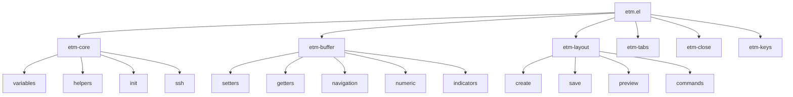

# ETM Architecture Overview

This document describes the internal architecture of Emacs Tab Manager (ETM), its design principles, and how components interact.

## Design Principles

1. **Modularity**: Each feature is self-contained in its own module
2. **Extensibility**: Easy to add new buffer types and features
3. **Non-intrusive**: Enhances tab-bar.el without replacing it
4. **Performance**: Efficient operations even with many tabs/buffers
5. **Testability**: Clean separation enables comprehensive testing

## Core Concepts

### Buffer Type System

ETM introduces a type system for buffers within each tab:

```
Tab "Development"
├── home buffer: main.py
├── semi-home buffers: [test_main.py, utils.py]
├── results buffers: [*compilation*, *pytest*]
└── numeric buffers: {1: README.md, 2: config.json, ...}
```

### Per-Tab Isolation

Buffer registrations are isolated per tab:
- Buffer "main.py" can be "home" in tab A and "semi-home" in tab B
- Each tab maintains its own numeric buffer assignments
- Navigation commands respect tab boundaries

## Component Architecture



## Data Structures

### Buffer Registry
```elisp
etm-registered-buffers
'(("tab-name" . (("home" . "buffer-name")
                 ("semi-home" . ("buffer1" "buffer2"))
                 ("results" . ("*output*" "*compilation*")))))
```

### Numeric Buffer Registry
```elisp
etm-numeric-buffers
'(("tab-name" . ((1 . "buffer1")
                 (2 . "buffer2")
                 (5 . "buffer5"))))
```

### Layout Structure
```elisp
'((file "~/project/" 0 1 80 30 "remote-host")
  (shell "~/project/" 80 1 80 30 "remote-host")
  (file "~/project/src/" 0 31 80 32 nil)
  (shell "~/project/" 80 31 80 32 nil))
;; Format: (type path x y width height host)
```

## Key Interactions

### Buffer Registration Flow

1. User presses `M-H` (set home buffer)
2. `etm-buffer-set-home` called
3. Validates buffer and tab
4. Updates `etm-registered-buffers`
5. Triggers any update hooks

### Layout Creation Flow

1. User saves layout with `etm-layout-save`
2. Current window configuration captured
3. Window positions calculated
4. Layout file generated with function definition
5. File automatically loaded for immediate use

### Numeric Buffer Visual Updates

1. Buffer registered to numeric slot
2. `etm-numeric-refresh-indicators` triggered
3. Tab-bar name updated with indicators
4. Mode-line updated for current buffer
5. Display refreshed

## Extension Points

### Adding New Buffer Types

1. Add type to `etm-custom-buffer-types`
2. Define jumper function:
   ```elisp
   (etm-buffer-define-buffer-type-jumper-function "docs")
   ```
3. Define setter function:
   ```elisp
   (etm-buffer-define-buffer-type-setter-function "docs")
   ```
4. Bind keys:
   ```elisp
   (define-key etm-command-map (kbd "d") #'etm-navigation-jump-by-buffer-type-docs)
   (define-key etm-command-map (kbd "D") #'etm-buffer-set-docs)
   ```

### Custom Layout Handlers

Layouts can be extended with custom window types:
```elisp
(defun --etm-layout-setup-custom-window (n window-type path host)
  "Setup custom window type."
  ;; Custom implementation
  )
```

## Performance Considerations

### Efficient Lookups
- Hash tables for O(1) host lookups
- Alist for buffer registry (small N per tab)
- Lazy evaluation for expensive operations

### Memory Management
- Per-tab isolation prevents global state bloat
- Weak references for buffer tracking
- Cleanup on tab close

## State Management

### Persistent State
- Layout files saved to disk
- Can be version controlled
- Shareable between users

### Runtime State
- Buffer registrations (in memory only)
- SSH connections per tab
- Numeric buffer assignments

### State Cleanup
- Tab close triggers buffer cleanup
- SSH connections closed on tab removal
- Circular references avoided

## Error Handling

### Graceful Degradation
- Missing buffers handled silently
- Invalid layouts show error message
- Corrupted state auto-corrects

### User Feedback
- Clear error messages
- Visual indicators for state
- Non-blocking operations

## Testing Strategy

### Unit Tests
- Each function tested in isolation
- Mock external dependencies
- Edge cases covered

### Integration Tests
- Multi-module interactions
- State consistency checks
- Performance benchmarks

### Test Coverage Goals
- Minimum 90% line coverage
- 100% for critical paths
- All user-facing commands tested

## Future Architecture Considerations

### Planned Enhancements
1. **Async Operations**: Non-blocking layout loading
2. **Buffer Groups**: Hierarchical buffer organization
3. **State Persistence**: Save/restore buffer registrations
4. **Remote Integration**: Better TRAMP support

### Scalability
- Support 100+ tabs efficiently
- Handle 1000+ buffers per session
- Optimize for large layouts

### Compatibility
- Maintain Emacs 26.1+ support
- Work with other tab/window packages
- Support terminal and GUI Emacs

## Security Considerations

### SSH Connections
- ControlMaster reuse for efficiency
- Proper cleanup on disconnect
- No credential storage

### File Operations
- Validate paths before operations
- Respect user permissions
- Safe file saving practices

### Code Execution
- Layout files are elisp (trust required)
- Validation before execution
- User confirmation for remote operations